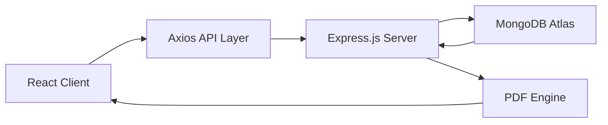

<h1 align="center"> SmartCV – AI Powered Resume Builder </h1>

<div align="center">

**Generate ATS-friendly resumes enhanced with AI in seconds**

AI-powered resume creation • Professional vocabulary • Editable anytime • PDF export

[](https://reactjs.org/)
[](https://nodejs.org/)
[](https://expressjs.com/)
[](https://www.mongodb.com/)
[](https://lucide.dev/)

</div>

---

## 📋 Table of Contents

- [Overview](#overview)
- [Features](#features)
- [Tech Stack](#tech-stack)
- [Project Structure](#project-structure)
- [Installation](#installation)
- [Configuration](#configuration)
- [Running the Application](#running-the-application)
- [Database Schema](#database-schema)
- [Team Members](#team-members)
- [License](#license)

---

## 🎯 Overview

SmartCV is an AI-powered resume builder that transforms user-provided information into professional, ATS-friendly resumes. Users fill a structured form, and the system enhances their content using AI with strong vocabulary and polished professional language.

The platform allows resume storage, editing, template switching, ATS scoring, and PDF downloads - making resume management simple and efficient for everyone.

---

## ✨ Features

### 🛠 Resume Creation

- **Form-based builder**: Intuitive interface to input your professional data seamlessly.
- **AI-Enhanced Language**: Powered by the **Groq API** for high-speed professional phrasing.
- **ATS-Friendly Formatting**: Optimized layouts designed to pass Applicant Tracking Systems.
- **ATS Score Checker**: Real-time analysis of how well your resume performs.
- **Multiple Templates**: Choose from a variety of professionally designed resume styles.
- **Custom Section Support**: Add unique sections tailored to your specific career path.

### 📁 Resume Management

- **Save to Account**: Secure cloud storage for all your resume drafts.
- **Edit Anytime**: Return to your documents and update them as your career evolves.
- **Smart Search**: Quickly filter through saved resumes using the integrated search system.
- **Document Control**: Easy options to delete or duplicate existing resumes.
- **PDF Download**: Export your final product in high-quality PDF format.

### 🤖 AI Capabilities

- **Vocabulary Enhancement**: Automatically suggests more impactful, "action-oriented" words.
- **Professional Phrasing**: Converts casual bullet points into industry-standard achievements.
- **Smart Suggestions**: Content-aware tips to fill in missing information.
- **Optimization Tips**: Actionable feedback to improve your ATS score and readability.

---

## 🛠 Tech Stack

### Frontend

- **React.js (v18)** - Core UI framework.
- **Lucide-React** - Professional SVG icon set.
- **Axios** - API communication.
- **Custom CSS3** - Glassmorphism and responsive Grid/Flexbox layouts.

### Backend

- **Node.js & Express** - Server-side logic and REST API.
- **MongoDB & Mongoose** - Database for resume and user data.
- **Groq API** - High-performance AI processing for content enhancement.
- **JWT** - Secure token-based authentication.

---

## 📁 Project Structure

```
├── backend
│   ├── middleware
│   │   └── auth.js
│   ├── models
│   │   └── User.js
│   ├── routes
│   │   ├── ai.js
│   │   ├── auth.js
│   │   └── resume.js
│   ├── .env.example
│   ├── .gitignore
│   ├── app.js
│   ├── package-lock.json
│   └── package.json
├── public
├── src
│   ├── assets
│   ├── components
│   │   ├── resume
│   │   │   ├── layouts
│   │   │   │   ├── JakesClassic.jsx
│   │   │   │   ├── Minimal.jsx
│   │   │   │   └── Modern.jsx
│   │   │   └── ResumePreview.jsx
│   │   └── Navbar.jsx
│   ├── data
│   │   └── temp.js
│   ├── pages
│   │   ├── ProjectChoice
│   │   │   ├── ProjectChoice.css
│   │   │   └── ProjectChoice.jsx
│   │   ├── TemplateSelect
│   │   │   ├── TemplateSelect.css
│   │   │   └── TemplateSelect.jsx
│   │   ├── componenets
│   │   │   ├── ATSChecker.css
│   │   │   ├── ATSChecker.jsx
│   │   │   ├── Editor.css
│   │   │   ├── EditorPanel.jsx
│   │   │   ├── PreviewPanel.jsx
│   │   │   ├── ResumeContext.jsx
│   │   │   ├── SectionCard.jsx
│   │   │   └── Sidebar.jsx
│   │   ├── dashboard
│   │   │   ├── CreateResumeBtn.jsx
│   │   │   ├── Dashboard.jsx
│   │   │   ├── List.jsx
│   │   │   ├── Navbar.jsx
│   │   │   └── dashboard.css
│   │   ├── Editor.jsx
│   │   ├── Register.jsx
│   │   └── login.jsx
│   ├── services
│   │   └── resumeService.js
│   ├── styles
│   │   └── shared
│   │       ├── app.css
│   │       └── workspace.css
│   ├── App.css
│   ├── App.jsx
│   ├── firebase.js
│   ├── index.css
│   └── main.jsx
├── .gitignore
├── README.md
├── eslint.config.js
├── index.html
├── package-lock.json
├── package.json
└── vite.config.js
```

---

## System Architecture


---
## Installation

### Prerequisites

- Node.js
- npm
- MongoDB
- Git

### Clone Repository

```bash
git clone https://github.com/dhruvlad1/SmartCV---An-AI-powered-resume-builder.git

cd SmartCV---An-AI-powered-resume-builder
```

## Setup

```bash
npm install
```

## Configuration

### Environment Variables

Create a `.env` file in the `backend` directory:

```bash
PORT=5000
MONGO_URI=your-mongodb-uri
JWT_SECRET=your-secret-key
GROQ_API_KEY=your-groq-api-key
```

## 🏃 Running the Application

### Development Mode

**Frontend:**

```bash
npm run dev
```

The app will run at `http://localhost:5173`

**Backend:**

```bash
cd backend
npm run dev
```

Backend will run at `http://localhost:5000`

## Production Build

```bash
npm run build
npm run preview
```

## Database Schema

```sql
  user_id: ObjectId,
  title: String,
  personalInfo: { name: String, email: String, ... },
  experience: Array,
  education: Array,
  skills: Array,
  lastModified: Date
```

---
## Team members

- **Dhruv Lad** - [GitHub](https://github.com/dhruvlad1)
- **Aryan Doshi** - [GitHub](https://github.com/aryan-2206)
- **Indraneel Hajarnis** - [GitHub](https://github.com/Indraneel-Hajarnis)
- **Dhairya Dabi** - [GitHub](https://github.com/Dhairya211206)
---
## License

This project is licensed under the MIT License - see the [LICENSE](LICENSE) file for details.
